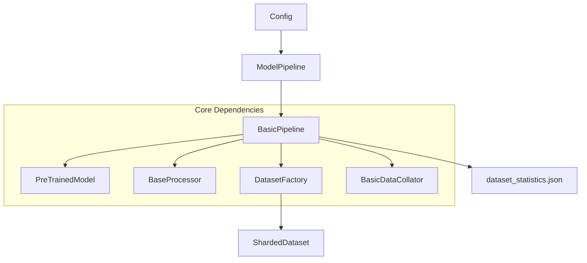

# Base Pipeline

The `base_pipeline` module provides a standardized interface and orchestration layer for initializing model architectures, data processors, and datasets within the Isaac-GR00T ecosystem. It defines the lifecycle for model setup, parameter management, and dataset statistics synchronization.

---

## Overview

The primary responsibility of the base pipeline is to act as a factory and manager for the core components required during training and evaluation. It abstracts the complexity of connecting high-level configurations to specific model classes and data loading strategies.

Key responsibilities include:
- **Model Orchestration**: Instantiating model classes and managing parameter state (e.g., freezing/unfreezing).
- **Data Integration**: Coordinating between processors, collators, and dataset factories to prepare the training environment.
- **Statistics Management**: Computing and persisting dataset normalization statistics for downstream inference tasks.

---

## Architecture

The pipeline architecture follows a hierarchical structure where generic behaviors are defined in a base class and specialized by concrete implementations for specific model types (e.g., Diffusion or Flow-Matching models).



The **[`ModelPipeline`](../gr00t/model/base/model_pipeline.py#L14)** defines the contract for returning standard components, while **[`BasicPipeline`](../gr00t/model/base/model_pipeline.py#L52)** implements the logic for connecting the `transformers` ecosystem with the local data pipeline.

---

## Core Components

> **Start here:** [`BasicPipeline`](../gr00t/model/base/model_pipeline.py#L52) — read its `setup()` method first to understand how the model and data environments are initialized.

### `ModelPipeline`
The **[`ModelPipeline`](../gr00t/model/base/model_pipeline.py#L14)** is an abstract base class that defines the required interface for all training pipelines. It holds references to the model, processor, datasets, and collators.

- **`setup()`**: Placeholder method for initialization logic.
- **`return_model()`**: Returns the instantiated **[`PreTrainedModel`](https://huggingface.co/docs/transformers/main_classes/model)**.
- **`return_dataset()`**: Returns a tuple of (train_dataset, eval_dataset).

### `BasicPipeline`
The **[`BasicPipeline`](../gr00t/model/base/model_pipeline.py#L52)** provides a concrete implementation for models that follow standard Vision-Language-Action (VLA) patterns, such as those using diffusion or flow-matching.

- **`setup()`**: Orchestrates the sequential creation of the model, dataset, and collator.
- **`_create_model()`**: Instantiates the model using `model_class` and unfreezes all parameters for training.
- **`_create_dataset()`**: Initializes the **[`BaseProcessor`](../gr00t/data/interfaces.py#L10)** and uses the **[`DatasetFactory`](../gr00t/data/dataset/factory.py#L14)** to build datasets.

---

## Usage & Extension

### Configuration
The pipeline is driven by the global **[`Config`](../gr00t/configs/base_config.py#L20)** object.

| Parameter | Type | Description |
| :--- | :--- | :--- |
| `config` | [`Config`](../gr00t/configs/base_config.py#L20) | Contains sub-configs for `model`, `data`, and `training`. |
| `save_cfg_dir` | `Path` | The directory where `dataset_statistics.json` is persisted. |
| `model_class` | `type[PreTrainedModel]` | The specific class to instantiate (set in subclasses). |
| `processor_class` | `type[BaseProcessor]` | The specific processor for data transformations. |

### Extending the Pipeline
To support a new model architecture, developers should subclass **[`BasicPipeline`](../gr00t/model/base/model_pipeline.py#L52)** and define the class attributes:

1.  Define the `model_class` targeting your implementation in [model_architecture.md](model_architecture.md).
2.  Define the `processor_class` for handling your specific modalities.
3.  (Optional) Override `_create_model` if custom freezing logic or weight loading is required.

Example:
```python
class MyCustomPipeline(BasicPipeline):
    model_class = MyModel
    processor_class = MyProcessor
```

### Error Handling
The pipeline expects the `save_cfg_dir` to be writable. If the dataset building fails or statistics cannot be computed, `_create_dataset` will raise exceptions from the **[`DatasetFactory`](../gr00t/data/dataset/factory.py#L14)**.

---

## Integration

The base pipeline serves as the central hub connecting several modules:
- **[configuration.md](configuration.md)**: Provides the `Config` schemas that drive pipeline behavior.
- **[data_pipeline.md](data_pipeline.md)**: Supplies the `DatasetFactory`, `BaseProcessor`, and `Collators` used in `_create_dataset`.
- **[model_architecture.md](model_architecture.md)**: Contains the specific model implementations (e.g., `Gr00tN1d6`) instantiated by the pipeline.
- **[training_engine.md](training_engine.md)**: Consumes the components returned by the pipeline to run the training loop.