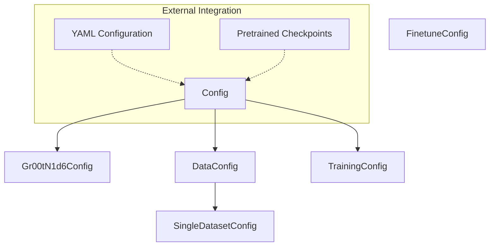

# Configuration Module

The configuration module provides a centralized, type-safe system for managing model hyperparameters, dataset specifications, and training settings through hierarchical Python dataclasses.

---

## Overview

The configuration module is the backbone for experiment reproducibility and system flexibility. It defines the schema for every aspect of the GR00T system, from low-level model architecture parameters to high-level distributed training settings.

Key responsibilities include:
- **Centralized Schema**: Defining all tunable parameters in one place using typed dataclasses.
- **Serialization**: Supporting seamless conversion between Python objects and YAML/JSON for persistence and CLI overrides.
- **Validation**: Ensuring that dataset paths, embodiment tags, and hardware configurations are consistent before execution begins.
- **Modality Management**: Mapping specific robot embodiments to their required sensory and action modalities.

---

## Architecture

The configuration system is structured as a tree, with [`Config`](../gr00t/configs/base_config.py#L20) serving as the root node that aggregates specialized sub-configurations.



The system uses a registration mechanism for models, allowing [`Config`](../gr00t/configs/base_config.py#L20) to dynamically instantiate the correct model-specific configuration class based on the `model_type` field.

---

## Core Components

> **Start here:** [`Config`](../gr00t/configs/base_config.py#L20) — read its [`load()`](../gr00t/configs/base_config.py#L38) and [`validate()`](../gr00t/configs/base_config.py#L82) methods first to understand how the system initializes and checks settings.

### Config

The **[`Config`](../gr00t/configs/base_config.py#L20)** class is the primary entry point for all system settings. It encapsulates model, data, and training sub-configs.

- **Primary Method**: [`load(path)`](../gr00t/configs/base_config.py#L38) — Reads a YAML file and populates the configuration object.
- **Validation**: [`validate()`](../gr00t/configs/base_config.py#L82) — Ensures embodiment tags match dataset types and precision settings are valid.

| Parameter | Type | Default | Description |
| :--- | :--- | :--- | :--- |
| `model` | `ModelUnionType` | [`Gr00tN1d6Config`](../gr00t/configs/model/gr00t_n1d6.py#L13) | Architectural settings for the VLA model. |
| `data` | [`DataConfig`](../gr00t/configs/data/data_config.py#L36) | Default [`DataConfig`](../gr00t/configs/data/data_config.py#L36) | Dataset paths, sampling rates, and modality configs. |
| `training` | [`TrainingConfig`](../gr00t/configs/training/training_config.py#L6) | Default [`TrainingConfig`](../gr00t/configs/training/training_config.py#L6) | Optimization, hardware, and logging settings. |

### DataConfig

The **[`DataConfig`](../gr00t/configs/data/data_config.py#L36)** manages how the system loads and mixes datasets. It supports complex multi-dataset setups through a list of **[`SingleDatasetConfig`](../gr00t/configs/data/data_config.py#L10)** objects.

| Parameter | Type | Default | Description |
| :--- | :--- | :--- | :--- |
| `datasets` | `List[SingleDatasetConfig]` | `[]` | List of datasets to mix for training. |
| `modality_configs` | `dict` | `MODALITY_CONFIGS` | Map of embodiment tags to their [`ModalityConfig`](../gr00t/data/types.py#L69). |
| `image_target_size` | `List[int]` | `[224, 224]` | Final resolution for images passed to the model. |

### Gr00tN1d6Config

The **[`Gr00tN1d6Config`](../gr00t/configs/model/gr00t_n1d6.py#L13)** contains specific hyperparameters for the N1d6 architecture, including the vision backbone and the diffusion transformer (DiT) action head.

- **Key Feature**: Inherits from `transformers.PretrainedConfig` for compatibility with the HuggingFace ecosystem.
- **Primary Method**: [`to_filtered_dict()`](../gr00t/configs/model/gr00t_n1d6.py#L125) — Generates a serializable dictionary, optionally excluding transient augmentation settings.

### TrainingConfig

The **[`TrainingConfig`](../gr00t/configs/training/training_config.py#L6)** defines the execution environment for training runs.

| Parameter | Type | Default | Description |
| :--- | :--- | :--- | :--- |
| `global_batch_size` | `int` | `1024` | Effective batch size across all devices. |
| `learning_rate` | `float` | `1e-4` | Peak learning rate for the optimizer. |
| `deepspeed_stage` | `int` | `2` | ZeRO optimization stage (1, 2, or 3). |

### FinetuneConfig

The **[`FinetuneConfig`](../gr00t/configs/finetune_config.py#L8)** is a specialized, flat configuration structure used for single-node fine-tuning tasks. It simplifies the interface for users targeting a specific robot embodiment.

---

## Usage & Extension

### Loading Configuration
Developers should use the [`Config`](../gr00t/configs/base_config.py#L20) class to initialize settings from a YAML file:

```python
from pathlib import Path
from gr00t.configs.base_config import Config

config = Config().load(Path("my_experiment.yaml"))
config.validate()
```

### Adding New Model Configurations
To add support for a new model architecture:
1. Create a new dataclass inheriting from `transformers.PretrainedConfig`.
2. Register it using [`register_model_config`](../gr00t/configs/model/__init__.py) (e.g., `register_model_config("MyNewModel", MyConfig)`).
3. Add the configuration to the `ModelUnionType` in [`base_config.py`](../gr00t/configs/base_config.py).

### Error Handling
The module implements strict validation to prevent runtime failures:
- **`ValueError`**: Raised in [`validate()`](../gr00t/configs/base_config.py#L82) if dataset paths are missing for specific types, if mixed precision settings conflict (e.g., both `fp16` and `bf16` enabled), or if mix ratios are invalid.
- **`ValueError`**: Raised in [`get_deepspeed_config()`](../gr00t/configs/base_config.py#L71) if an unsupported DeepSpeed stage is requested.

---

## Integration

The configuration module integrates directly with several other system components:

- **[Data Pipeline](data_pipeline.md)**: Uses [`DataConfig`](../gr00t/configs/data/data_config.py#L36) and [`SingleDatasetConfig`](../gr00t/configs/data/data_config.py#L10) to instantiate the [`DatasetFactory`](../gr00t/data/dataset/factory.py#L14).
- **[Model Architecture](model_architecture.md)**: Consumes [`Gr00tN1d6Config`](../gr00t/configs/model/gr00t_n1d6.py#L13) during the instantiation of [`Gr00tN1d6`](../gr00t/model/gr00t_n1d6/gr00t_n1d6.py#L411).
- **[Training Engine](training_engine.md)**: The [`Gr00tTrainer`](../gr00t/experiment/trainer.py#L178) relies on [`TrainingConfig`](../gr00t/configs/training/training_config.py#L6) for optimization and logging logic.
- **[Policy Inference](policy_inference.md)**: The [`Gr00tPolicy`](../gr00t/policy/gr00t_policy.py#L46) uses the model configuration to set up the inference pipeline correctly.