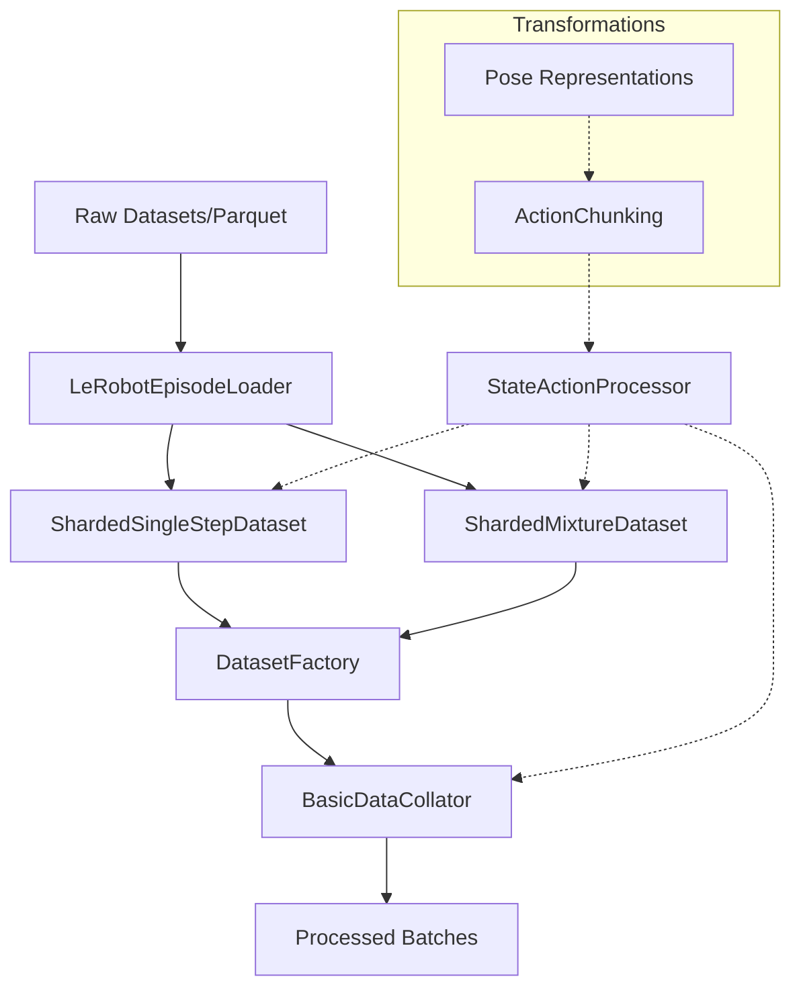

# data_pipeline

The `data_pipeline` module provides a robust and flexible infrastructure for loading, processing, and batching multi-modal robotic data (images, states, actions, text) for training and evaluating VLA (Vision-Language-Action) models.

---

## Overview

The `data_pipeline` module is responsible for the end-to-end data lifecycle in the Isaac-GR00T framework, from raw dataset ingestion to the delivery of processed, model-ready batches. It supports cross-embodiment learning by providing standardized interfaces for diverse robotic platforms and complex state/action transformations.

Key responsibilities include:
- **Dataset Abstraction**: Unified loading of heterogeneous datasets through sharded interfaces.
- **Synchronized Sampling**: Aligning temporal sequences of images, states, and actions.
- **Spatial Processing**: Transforming between absolute and relative coordinate frames for end-effector and joint poses.
- **Normalization & Encoding**: Applying min/max or mean/std normalization and sin/cos encodings to low-dimensional data.
- **Efficient Batching**: Multi-threaded data loading and collation for high-throughput training.

---

## Architecture

The architecture follows a layered approach where raw data is gradually refined and combined into training samples.

The pipeline starts with the [`LeRobotEpisodeLoader`](../gr00t/data/dataset/lerobot_episode_loader.py#L63), which reads individual episodes. These are wrapped by [`ShardedDataset`](../gr00t/data/interfaces.py#L71) implementations that handle sampling and multi-dataset mixing. The [`StateActionProcessor`](../gr00t/data/state_action/state_action_processor.py#L33) performs the heavy lifting of normalization and coordinate transforms before the [`BasicDataCollator`](../gr00t/data/collator/collators.py#L6) finalizes the batch.

---

## Core Components

> **Start here:** [`DatasetFactory`](../gr00t/data/dataset/factory.py#L14) — read its `create_dataset()` method first to understand how the pipeline is instantiated.

### Dataset Management

The **DatasetFactory** is the primary entry point for creating training or evaluation datasets based on a configuration object.

- Primary Method: [`create_dataset()`](../gr00t/data/dataset/factory.py#L21) - returns a `torch.utils.data.Dataset` (usually a sharded mixture).

| Parameter | Type | Default | Description |
| - | - | - | - |
| `config` | `DataConfig` | (Required) | High-level data configuration. |
| `processor` | `BaseProcessor` | `None` | Optional processor for state/action normalization. |
| `training` | `bool` | `True` | Whether to create a training or evaluation dataset. |

**Sharded Mixture & Single Step Datasets**
The [`ShardedMixtureDataset`](../gr00t/data/dataset/sharded_mixture_dataset.py#L109) combines multiple datasets with specified sampling weights. It relies on [`ShardedSingleStepDataset`](../gr00t/data/dataset/sharded_single_step_dataset.py#L66) to handle individual dataset sharding and sequential sampling logic.

### State and Action Processing

The **StateActionProcessor** is a critical component that handles all numerical transformations for states and actions.

- Primary Method: [`apply()`](../gr00t/data/state_action/state_action_processor.py#L427) - processes raw state and action dictionaries into normalized/transformed forms.

It supports various normalization schemes and can convert between absolute and relative representations using the `_convert_to_relative_action()` and `_convert_to_absolute_action()` internal methods. It uses [`ActionRepresentation`](../gr00t/data/types.py#L18) to determine the transformation logic.

**Pose and Action Representations**
The module defines sophisticated types for robotic poses:
- [`Pose`](../gr00t/data/state_action/pose.py#L86): Abstract base for all pose types.
- [`EndEffectorPose`](../gr00t/data/state_action/pose.py#L297): Handles 3D translation and various rotation formats (6D, Quaternions, Euler).
- [`JointPose`](../gr00t/data/state_action/pose.py#L159): Simple vector representation for joint positions.

These are managed in chunks for temporal sequences:
- [`ActionChunk`](../gr00t/data/state_action/action_chunking.py#L14): Base class for temporal sequences of actions.
- [`EndEffectorActionChunk`](../gr00t/data/state_action/action_chunking.py#L395): Sequence of EEF poses with frame transformation capabilities.
- [`JointActionChunk`](../gr00t/data/state_action/action_chunking.py#L194): Sequence of joint poses.

### Data Types and Interfaces

Standardized data structures ensure compatibility across the system.

- [`VLAStepData`](../gr00t/data/types.py#L36): The core container for a single time step's images, states, and actions.
- [`ModalityConfig`](../gr00t/data/types.py#L69): Defines how specific modalities (vision, state, action) should be sampled using `delta_indices`.
- [`EmbodimentTag`](../gr00t/data/embodiment_tags.py#L14): An enumeration used to identify and handle different robotic embodiments (e.g., GR1, G1, SO100).

---

## Usage & Extension

### Creating a Custom Dataset
To add a new dataset, ensure it follows the LeRobot format and then register it in the embodiment configurations. The [`LeRobotEpisodeLoader`](../gr00t/data/dataset/lerobot_episode_loader.py#L63) will automatically detect the features.

### Extending Pose Types
If a new robotic part requires a different coordinate system:
1. Inherit from [`Pose`](../gr00t/data/state_action/pose.py#L86).
2. Implement the `__sub__` and `__add__` operators for relative transformations.
3. Create a corresponding [`ActionChunk`](../gr00t/data/state_action/action_chunking.py#L14) subclass.

### Error Handling
The pipeline uses standard Python exceptions for data issues:
- `ValueError`: Raised by [`StateActionProcessor`](../gr00t/data/state_action/state_action_processor.py#L33) if required state keys are missing for relative transformations.
- `IndexError`: Raised by [`LeRobotEpisodeLoader`](../gr00t/data/dataset/lerobot_episode_loader.py#L63) if attempting to sample outside episode boundaries.
- `KeyError`: Raised during collation if the batch contains inconsistent embodiment tags.

---

## Integration

The `data_pipeline` interacts closely with several other modules:

- **[`configuration`](configuration.md)**: Provides [`DataConfig`](../gr00t/configs/data/data_config.py#L36) and [`SingleDatasetConfig`](../gr00t/configs/data/data_config.py#L10) to drive the factory.
- **[`model_architecture`](model_architecture.md)**: Consumes the processed batches. The [`Gr00tN1d6Processor`](../gr00t/model/gr00t_n1d6/processing_gr00t_n1d6.py#L108) often wraps the `StateActionProcessor` for high-level model interaction.