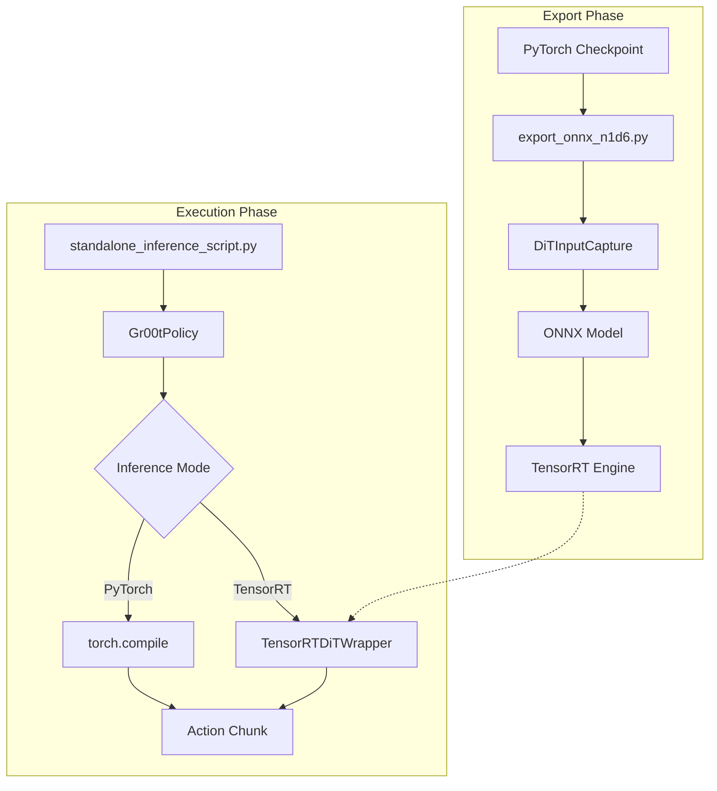

# Deployment

The **Deployment** module provides the infrastructure for optimizing and running GR00T-N1D6 models in high-performance environments. It focuses on exporting the core Diffusion Transformer (DiT) to ONNX and accelerating inference via TensorRT, enabling real-time control on robot hardware.

## Overview

The deployment pipeline is designed to bridge the gap between PyTorch training and real-world execution. Its primary responsibilities include:
- **Optimization:** Converting heavy PyTorch components into optimized TensorRT engines.
- **Verification:** Providing standalone scripts to compare the accuracy and performance of optimized models against the original PyTorch implementation.
- **Inference:** Supporting asynchronous data prefetching and GPU execution to minimize end-to-end latency.

---

## Architecture

The deployment workflow follows a two-stage process: an **Export Phase** where the model is serialized and optimized, and an **Execution Phase** where the optimized engine is used for inference.



### Key Workflow Narrative
1.  **Input Capture:** Real-world observation shapes are captured using [`DiTInputCapture`](../scripts/deployment/export_onnx_n1d6.py#L34) to define dynamic axes for the ONNX model.
2.  **Wrapper Injection:** The DiT is wrapped in a [`DiTWrapper`](../scripts/deployment/export_onnx_n1d6.py#L227) during export to handle the translation between ONNX positional arguments and internal keyword arguments.
3.  **Engine Loading:** During inference, the [`TensorRTDiTWrapper`](../scripts/deployment/standalone_inference_script.py#L78) replaces the standard PyTorch DiT forward pass, using CUDA streams for asynchronous execution.

---

## Core Components

> **Start here:** [`standalone_inference_script.py`](../scripts/deployment/standalone_inference_script.py) — the primary entry point for evaluating both PyTorch and TensorRT performance.

### DiT Input Management
The DiT requires specific attention to its input tensors (state embeddings, visual-language embeddings, and timesteps).

-   **[`DiTInputCapture`](../scripts/deployment/export_onnx_n1d6.py#L34)**: A utility used to hook into the model during a single "warm-up" inference pass. It logs and stores the shapes of all keyword arguments to ensure the ONNX export correctly identifies batch and sequence length dimensions as dynamic.
-   **[`DiTWrapper`](../scripts/deployment/export_onnx_n1d6.py#L227)**: Since `torch.onnx.export` primarily handles positional arguments, this internal class provides a compatibility layer. It maps positional inputs back to the keyword arguments expected by the underlying [`DiT`](../gr00t/model/modules/dit.py#L172) module.

### TensorRT Acceleration
-   **[`TensorRTDiTWrapper`](../scripts/deployment/standalone_inference_script.py#L78)**: The core runtime component for TensorRT inference. It handles engine deserialization, binding allocation, and input shape setting. It uses `execute_async_v3` to run inference on the current PyTorch CUDA stream, allowing for tight integration with other PyTorch-based preprocessing.
-   **[`replace_dit_with_tensorrt`](../scripts/deployment/standalone_inference_script.py#L139)**: A utility function that hot-swaps the DiT component of a [`Gr00tPolicy`](../gr00t/policy/gr00t_policy.py#L46) with a TensorRT-backed instance.

### Inference Infrastructure
The [`standalone_inference_script.py`](../scripts/deployment/standalone_inference_script.py) implements a high-efficiency inference loop.

-   **[`run_single_trajectory`](../scripts/deployment/standalone_inference_script.py#L418)**: Executes a full trajectory evaluation. It uses a `ThreadPoolExecutor` to perform [`prepare_observation_data`](../scripts/deployment/standalone_inference_script.py#L384) on the CPU for the *next* timestep while the GPU is still processing the *current* inference step.
-   **[`evaluate_predictions`](../scripts/deployment/standalone_inference_script.py#L510)**: Computes MSE and MAE metrics between predicted actions and ground-truth dataset actions.

---

## Usage & Extension

### Exporting to ONNX
To export a trained checkpoint to ONNX for subsequent TensorRT optimization:

```bash
python scripts/deployment/export_onnx_n1d6.py \
    --model_path /path/to/checkpoint \
    --dataset_path /path/to/demo_data \
    --output_dir ./onnx_export
```

### Running Standalone Inference
The standalone script supports two main modes: standard PyTorch (optimized with `torch.compile`) and TensorRT.

#### Parameters
The following parameters are managed via [`ArgsConfig`](../scripts/deployment/standalone_inference_script.py#L555):

| Parameter | Type | Default | Description |
| :--- | :--- | :--- | :--- |
| `model_path` | `str` | `None` | Path to the PyTorch checkpoint directory. |
| `inference_mode` | `Literal` | `pytorch` | Either `pytorch` or `tensorrt`. |
| `trt_engine_path`| `str` | `...` | Path to the `.trt` engine file. |
| `action_horizon` | `int` | `16` | Number of steps per action chunk. |
| `video_backend` | `str` | `torchcodec`| Backend used for decoding dataset videos. |

### Adding New Optimizations
To support a new optimization backend (e.g., OpenVINO):
1.  Create a new wrapper class similar to [`TensorRTDiTWrapper`](../scripts/deployment/standalone_inference_script.py#L78).
2.  Implement a replacement function in the style of [`replace_dit_with_tensorrt`](../scripts/deployment/standalone_inference_script.py#L139).
3.  Add the new mode to the `inference_mode` literal in [`ArgsConfig`](../scripts/deployment/standalone_inference_script.py#L555).

---

## Integration

-   **[`policy_inference.md`](policy_inference.md)**: Describes the high-level policy wrapper used by the deployment scripts.
-   **[`gr00t_n1d6_model.md`](gr00t_n1d6_model.md)**: Documentation for the model architecture being optimized.
-   **[`data_pipeline.md`](data_pipeline.md)**: Explains the dataset loaders used to feed observations during standalone evaluation.