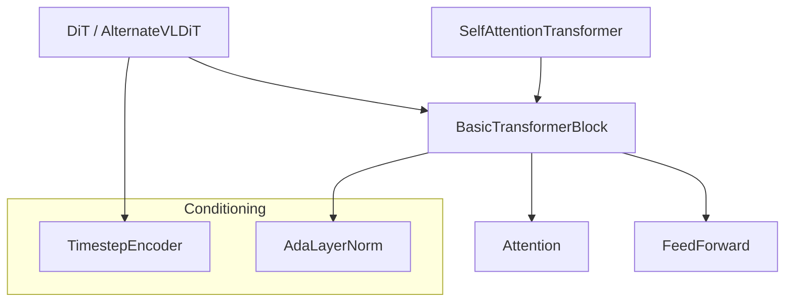

# Diffusion Transformer
The `diffusion_transformer` module provides the core transformer-based architectures for diffusion-based action generation in the GR00T system. It implements various flavors of Diffusion Transformers (DiT), including support for cross-attention with vision-language features and adaptive normalization.

---

## Overview
This module resides within [`gr00t/model/modules/dit.py`](../gr00t/model/modules/dit.py) and is primarily used by the [gr00t_n1d6_model](gr00t_n1d6_model.md) to predict noise or velocities in a flow-matching or diffusion process. It serves as the primary reasoning engine that fuses multi-modal observations with temporal conditioning.

Key responsibilities include:
- Encoding diffusion timesteps into high-dimensional embeddings.
- Implementing adaptive layer normalization (AdaLN) for temporal conditioning.
- Providing flexible transformer blocks that support both self-attention and cross-attention.
- Supporting specialized architectures like [`AlternateVLDiT`](../gr00t/model/modules/dit.py#L289) for efficient vision-language feature fusion.

---

## Architecture
The architecture is centered around the [`DiT`](../gr00t/model/modules/dit.py#L172) class, which orchestrates a sequence of transformer blocks conditioned by a global timestep embedding.

The data flow starts with noisy latents entering the [`DiT`](../gr00t/model/modules/dit.py#L172) blocks. Each block applies adaptive normalization using the output of the [`TimestepEncoder`](../gr00t/model/modules/dit.py#L12), followed by self-attention and optional cross-attention with external encoder states (like vision tokens).

---

## Core Components
> **Start here:** [`DiT`](../gr00t/model/modules/dit.py#L172) — read its [`forward()`](../gr00t/model/modules/dit.py#L219) method first to understand how temporal conditioning and cross-attention are integrated.

### TimestepEncoder
The **TimestepEncoder** ([`TimestepEncoder`](../gr00t/model/modules/dit.py#L12)) transforms scalar diffusion timesteps into continuous embeddings. It utilizes sinusoidal projections followed by a MLP-based embedding layer to produce vectors that condition the transformer layers.
- **Key Entry Point:** The [`forward()`](../gr00t/model/modules/dit.py#L17) method processes a batch of timesteps and returns embeddings of shape `(N, inner_dim)`.

### AdaLayerNorm
The **AdaLayerNorm** ([`AdaLayerNorm`](../gr00t/model/modules/dit.py#L25)) implements adaptive layer normalization where the scale and shift parameters are derived from the timestep embedding. This mechanism allows the model to modulate its internal representations dynamically based on the current stage of the diffusion process.
- **Key Entry Point:** The [`forward()`](../gr00t/model/modules/dit.py#L39) method applies normalized scaling and shifting to input tensors using a conditioning temporal embedding.

### BasicTransformerBlock
The **BasicTransformerBlock** ([`BasicTransformerBlock`](../gr00t/model/modules/dit.py#L51)) is a highly configurable transformer layer. It supports standard self-attention, cross-attention with encoder hidden states, and multiple normalization types including the adaptive variant.
- **Key Entry Point:** The [`forward()`](../gr00t/model/modules/dit.py#L123) method executes a single transformer pass, handling normalization, attention mechanisms, and feed-forward residual updates.

### DiT
The **DiT** ([`DiT`](../gr00t/model/modules/dit.py#L172)) class implements the standard Diffusion Transformer architecture. It manages a stack of transformer blocks and incorporates temporal conditioning via a global timestep encoder.
- **Key Entry Point:** The [`forward()`](../gr00t/model/modules/dit.py#L219) method predicts the denoised state or velocity for given noisy inputs and diffusion steps.

### AlternateVLDiT
The **AlternateVLDiT** ([`AlternateVLDiT`](../gr00t/model/modules/dit.py#L289)) is a specialized variant of the Diffusion Transformer designed for multi-modal inputs. It alternates cross-attention between different segments of the encoder hidden states (e.g., separating vision and language tokens) to improve focus and computational efficiency.
- **Key Entry Point:** The [`forward()`](../gr00t/model/modules/dit.py#L298) method uses provided masks to selectively attend to different modalities across the transformer blocks.

### SelfAttentionTransformer
The **SelfAttentionTransformer** ([`SelfAttentionTransformer`](../gr00t/model/modules/dit.py#L367)) provides a baseline transformer stack that relies exclusively on self-attention. It does not include timestep encoding or cross-attention, making it suitable for simple sequence-to-sequence modeling within the GR00T pipeline.
- **Key Entry Point:** The [`forward()`](../gr00t/model/modules/dit.py#L407) method processes input hidden states through successive self-attention blocks.

---

## Usage & Extension
The Diffusion Transformer is configured through the [configuration](configuration.md) system, specifically via `Gr00tN1d6Config`.

| Parameter | Type | Default | Description |
| :--- | :--- | :--- | :--- |
| `num_attention_heads` | `int` | `8` | Number of attention heads per block. |
| `attention_head_dim` | `int` | `64` | Dimensionality of each attention head. |
| `num_layers` | `int` | `12` | Total number of transformer blocks in the stack. |
| `dropout` | `float` | `0.1` | Dropout rate applied to attention and feed-forward layers. |
| `norm_type` | `str` | `"ada_norm"` | Normalization strategy (`ada_norm` for diffusion conditioning). |
| `interleave_self_attention` | `bool` | `False` | Whether to interleave self-attention blocks with cross-attention. |

### Extension Points
1. **New Normalization:** Developers can implement new conditioning mechanisms by adding classes similar to [`AdaLayerNorm`](../gr00t/model/modules/dit.py#L25) and updating the [`BasicTransformerBlock`](../gr00t/model/modules/dit.py#L51) factory logic.
2. **Custom Cross-Attention:** Specialized attention patterns for new modalities can be implemented by subclassing [`DiT`](../gr00t/model/modules/dit.py#L172) and overriding the block iteration logic, as seen in [`AlternateVLDiT`](../gr00t/model/modules/dit.py#L289).

---

## Integration
The `diffusion_transformer` module is a critical dependency for the following systems:
- [gr00t_n1d6_model](gr00t_n1d6_model.md): Integrates the `DiT` as the primary action-prediction backbone.
- [eagle_backbone](eagle_backbone.md): Provides the encoder hidden states used for cross-attention conditioning.
- [deployment](deployment.md): Utilizes `DiTWrapper` and `DiTInputCapture` to prepare these models for high-performance inference via ONNX or TensorRT.
- [configuration](configuration.md): Centralizes the hyperparameters required to instantiate the transformer blocks.