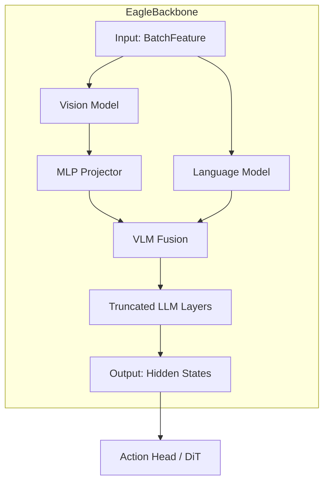

# eagle_backbone
The `eagle_backbone` module provides a high-level wrapper for the NVIDIA Eagle Vision-Language Model (VLM), serving as the foundational multimodal feature extractor for the system. It processes visual and textual inputs to generate rich latent representations used for downstream action prediction.

## Overview
The **EagleBackbone** module is responsible for initializing, configuring, and managing the lifecycle of the NVIDIA Eagle VLM. It acts as the "eyes" and "brain" of the model's perception layer, transforming raw pixel values and tokenized text into a unified embedding space.

Key responsibilities include:
- Loading and instantiating the [`Eagle-Block2A-2B-v2`](../gr00t/model/modules/nvidia/Eagle-Block2A-2B-v2) architecture and weights.
- Providing flexible parameter tuning configurations, such as freezing the visual encoder while training the language model.
- Managing model layer truncation via the `select_layer` parameter to optimize compute performance and feature relevance.
- Handling high-performance data precision (BFloat16) and attention mechanisms (Flash Attention 2).

---

## Architecture
The following diagram illustrates how the `EagleBackbone` integrates vision and language components to produce multimodal features.



The architecture utilizes a vision encoder and a language model bridged by an MLP projector. By default, the `EagleBackbone` allows developers to select specific layers from the language model, effectively "cutting" the model at an intermediate point to extract features that are more conducive to control tasks than final text-prediction layers.

---

## Core Components

> **Start here:** [`EagleBackbone`](../gr00t/model/modules/eagle_backbone.py#L8) — read its [`forward`](../gr00t/model/modules/eagle_backbone.py#L111) method first to understand the data transformation pipeline.

### EagleBackbone
The [`EagleBackbone`](../gr00t/model/modules/eagle_backbone.py#L8) class is the primary implementation of the perceptual backbone. It wraps the NVIDIA Eagle model and exposes a simplified interface for training and inference.

- **Primary Entry Point:** [`forward`](../gr00t/model/modules/eagle_backbone.py#L111)
  - **Description:** Executes the forward pass of the VLM, ensuring frozen components are in evaluation mode and returning the final hidden states from the selected layer.
  - **Returns:** A [`BatchFeature`](../gr00t/model/modules/eagle_backbone.py#L5) containing `backbone_features`, `backbone_attention_mask`, and `image_mask`.

- **Configuration:**
The constructor accepts the following parameters to customize the backbone behavior:

| Parameter | Type | Default | Description |
| :--- | :--- | :--- | :--- |
| `model_name` | `str` | `"nvidia/Eagle-Block2A-2B-v2"` | The path or name identifier for the pre-trained model. |
| `tune_llm` | `bool` | `False` | Enables/disables training for the entire language model. |
| `tune_visual` | `bool` | `False` | Enables/disables training for the vision model and projector. |
| `select_layer` | `int` | `-1` | Layer index to extract features from; subsequent layers are removed. |
| `use_flash_attention` | `bool` | `False` | Whether to utilize optimized Flash Attention 2 kernels. |
| `load_bf16` | `bool` | `False` | Whether to load model weights and execute in BFloat16 precision. |
| `tune_top_llm_layers` | `int` | `0` | Specifies a count of top LLM layers to unfreeze if `tune_llm` is False. |

- **Extension Points:**
  - **Model Architecture:** Developers can modify the `__init__` logic to support alternative vision-language backbones beyond the default Eagle model.
  - **Input Pre-processing:** The [`prepare_input`](../gr00t/model/modules/eagle_backbone.py#L108) method can be extended to handle custom batch transformations or augmentation logic before passing data to the model.

- **Error Handling:**
  - The module raises a `ValueError` if an unsupported `model_name` is provided.
  - Specific assertions verify that `Flash Attention` and `BFloat16` are enabled when using the default NVIDIA Eagle model, ensuring stability and alignment with NVIDIA's requirements.

---

## Usage & Extension
### Manual Initialization
When using the backbone standalone or within a custom experiment, it is initialized via the standard PyTorch pattern.

```python
from gr00t.model.modules.eagle_backbone import EagleBackbone

# Initialize for fine-tuning the visual encoder only
backbone = EagleBackbone(
    tune_llm=False,
    tune_visual=True,
    load_bf16=True,
    use_flash_attention=True
)
```

### Parameter Management
The backbone provides a specialized [`set_trainable_parameters`](../gr00t/model/modules/eagle_backbone.py#L65) method. This allows for complex training regimes, such as "top-heavy" tuning where only the final layers of the language model are updated, preserving the pre-trained knowledge in the earlier layers while adapting the output to new tasks.

### Evaluation Mode for Frozen Modules
The [`set_frozen_modules_to_eval_mode`](../gr00t/model/modules/eagle_backbone.py#L93) method is a critical utility. It overrides the default behavior of `model.train()` to ensure that modules like `Dropout` or `BatchNormalization` do not fluctuate for components that have `requires_grad=False`, maintaining deterministic feature extraction during training.

---

## Integration
The `eagle_backbone` module is a central node in the perception-action loop and interacts with the following modules:

- **Model Architecture:** Acts as the primary feature extractor for the [`ModelPipeline`](../gr00t/model/base/model_pipeline.py#L14) (see [base_pipeline.md]).
- **Diffusion Transformer:** Feeds extracted embeddings into the [`DiT`](../gr00t/model/modules/dit.py#L172) for temporal action modeling (see [diffusion_transformer.md]).
- **NVIDIA Eagle VL:** Directly utilizes the low-level modeling and configuration files defined in the [`nvidia_eagle_vl`](nvidia_eagle_vl.md) module.
- **Configuration Engine:** Tuning and loading parameters are typically driven by the [`Gr00tN1d6Config`](../gr00t/configs/model/gr00t_n1d6.py#L13) (see [configuration.md]).