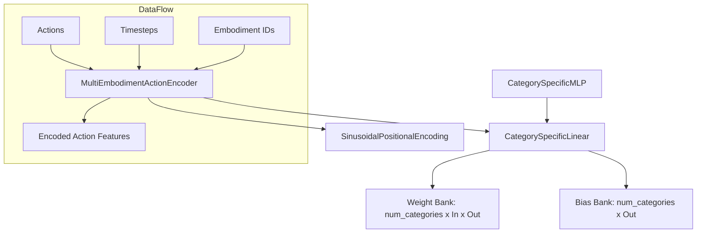

# Embodiment Conditioned MLP

The `embodiment_conditioned_mlp` module provides specialized neural network components designed to handle multi-embodiment data by conditioning weights on robot-specific identifiers. This allows the model to learn shared representations while maintaining distinct control logic for different robot architectures.

## Overview
---

The primary responsibility of this module is to enable the **GR00T** model to process actions and states from diverse robotic platforms (e.g., humanoids, mobile manipulators) within a single architecture. It achieves this through "Category-Specific" layers that index into a bank of learnable parameters based on a provided embodiment ID.

Key features include:
- **Weight Conditioning**: Separate linear weights and biases for each supported embodiment.
- **Temporal Encoding**: Sinusoidal positional embeddings for integrating time or diffusion step information.
- **Dynamic Scaling**: Mechanisms to expand action dimensions when adding new robots with more degrees of freedom.

## Architecture
---

The module follows a hierarchical structure where low-level conditioned linear layers are composed into high-level action encoders.

## Core Components
---

> **Start here:** [`MultiEmbodimentActionEncoder`](../gr00t/model/modules/embodiment_conditioned_mlp.py#L162) — read its `forward()` method to understand how actions, time, and embodiment IDs are fused.

### MultiEmbodimentActionEncoder
The [`MultiEmbodimentActionEncoder`](../gr00t/model/modules/embodiment_conditioned_mlp.py#L162) is the primary entry point for transforming raw action vectors into latent features suitable for transformer-based policies.

- **Primary Method**: `forward(actions, timesteps, cat_ids)`
- **Functionality**: Replicates a single timestep across the action sequence, applies conditioned linear projections, and fuses them with sinusoidal time embeddings using a Swish-activated bottleneck.

| Parameter | Type | Default | Description |
| :--- | :--- | :--- | :--- |
| `action_dim` | `int` | - | Dimension of the raw action vector. |
| `hidden_size` | `int` | - | Dimension of the output features (and internal hidden layers). |
| `num_embodiments` | `int` | - | Total number of unique robots supported by the weight bank. |

### CategorySpecificLinear
The [`CategorySpecificLinear`](../gr00t/model/modules/embodiment_conditioned_mlp.py#L44) layer acts as a drop-in replacement for `nn.Linear` when multi-robot support is required. It maintains a 3D weight tensor of shape `(num_categories, input_dim, output_dim)`.

- **Primary Method**: `forward(x, cat_ids)`
- **Functionality**: Uses `torch.bmm` (Batch Matrix Multiplication) to apply the specific weight matrix corresponding to each sample's embodiment ID in the batch.

### CategorySpecificMLP
A multi-layer perceptron wrapper [`CategorySpecificMLP`](../gr00t/model/modules/embodiment_conditioned_mlp.py#L128) that stacks two [`CategorySpecificLinear`](../gr00t/model/modules/embodiment_conditioned_mlp.py#L44) layers with a ReLU activation between them.

### SinusoidalPositionalEncoding
The [`SinusoidalPositionalEncoding`](../gr00t/model/modules/embodiment_conditioned_mlp.py#L11) produces standard transformer-style embeddings. It is used within the action encoder to provide the model with awareness of the current diffusion timestep or temporal index.

### SmallMLP
A standard, non-conditioned [`SmallMLP`](../gr00t/model/modules/embodiment_conditioned_mlp.py#L117) consisting of two linear layers. This is typically used for auxiliary tasks or components where embodiment-specific logic is not required.

## Usage & Extension
---

### Expanding Action Dimensions
When fine-tuning on a new embodiment that has a larger action space (e.g., more joints), use the `expand_action_dimension` method found in [`MultiEmbodimentActionEncoder`](../gr00t/model/modules/embodiment_conditioned_mlp.py#L218) and [`CategorySpecificLinear`](../gr00t/model/modules/embodiment_conditioned_mlp.py#L74).

1. Identify the new target `action_dim`.
2. Call `encoder.expand_action_dimension(old_dim, new_dim)`.
3. The module will copy existing weights to the new dimensions to provide a stable initialization for further training.

### Handling New Embodiments
To add support for more robots:
- Update the `num_embodiments` parameter in the model configuration.
- Ensure the [`EmbodimentTag`](../gr00t/data/embodiment_tags.py#L14) in the data pipeline maps correctly to the indices used by these layers.

## Integration
---

- **Model Architecture**: These components are heavily utilized by the [`Gr00tN1d6`](../gr00t/model/gr00t_n1d6/gr00t_n1d6.py#L411) model and its [`Gr00tN1d6ActionHead`](../gr00t/model/gr00t_n1d6/gr00t_n1d6.py#L19).
- **Diffusion Pipeline**: Integrated into the [`DiT`](../gr00t/model/modules/dit.py#L172) modules to condition action denoising on robot identity.
- **Configuration**: Parameters are defined in [`Gr00tN1d6Config`](../gr00t/configs/model/gr00t_n1d6.py#L13).

For more details on the overall model structure, see the [gr00t_n1d6_model.md](gr00t_n1d6_model.md) documentation.