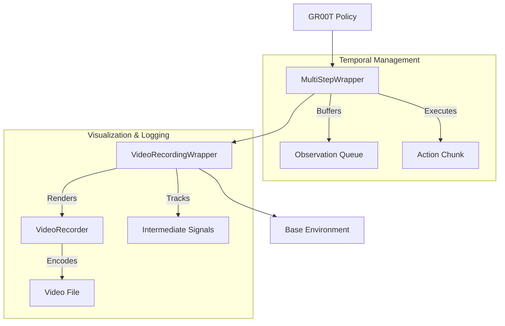

# Evaluation Environments

The `evaluation_environments` module provides specialized gymnasium wrappers to align simulation environments with the temporal and structural requirements of Vision-Language-Action (VLA) models. It handles multi-step observation history, action chunking execution, and high-fidelity video recording of evaluation rollouts.

---

## Overview

The module bridges the gap between standard environment interfaces and the GR00T policy's needs. Its primary responsibilities include:

- **Temporal Alignment**: Managing observation buffers to provide models with historical context (e.g., past 5 frames).
- **Action Chunking**: Executing sequences of actions predicted by the model over multiple environment steps to improve temporal consistency.
- **Evaluation Visualization**: Recording multi-view videos with overlaid language instructions and success metrics for qualitative analysis.
- **Metric Tracking**: Extracting and logging intermediate signals (like grasp success or object distances) into standardized formats.

---

## Architecture

The evaluation wrappers are designed to be stacked on top of base simulation environments (such as SimplerEnv, LIBERO, or RoboCasa), transforming their single-step interactions into the multi-step sequences required by the policy.



---

## Core Components

> **Start here:** [`MultiStepWrapper`](../gr00t/eval/sim/wrapper/multi_step_wrapper.py#L66) — read its `step()` method first to understand how action chunks are executed.

### MultiStepWrapper

The [`MultiStepWrapper`](../gr00t/eval/sim/wrapper/multi_step_wrapper.py#L66) is responsible for temporal stacking of observations and the sequential execution of action chunks. It maintains a [`deque`](https://docs.python.org/3/library/collections.html#collections.deque) of historical observations and slices input action dictionaries to apply them over multiple environment steps.

- **Primary Method**: `step(action)` executes `n_action_steps` in the underlying environment, returning aggregated rewards and stacked observations.
- **Observation Stacking**: It uses `video_delta_indices` and `state_delta_indices` to select specific historical frames from its internal buffer.
- **Reward Aggregation**: Rewards collected during the multi-step execution are aggregated using methods like `max`, `mean`, or `sum`.

| Parameter | Type | Default | Description |
| :--- | :--- | :--- | :--- |
| `video_delta_indices` | `np.ndarray` | Required | Indices relative to current time for video frames (e.g., `[-4, -3, -2, -1, 0]`). |
| `state_delta_indices` | `np.ndarray` | Required | Indices relative to current time for low-dim states. |
| `n_action_steps` | `int` | Required | Number of actions to execute per wrapper step (chunk size). |
| `reward_agg_method` | `str` | `"max"` | Method to aggregate rewards across the chunk (`max`, `min`, `mean`, `sum`). |

### VideoRecordingWrapper

The [`VideoRecordingWrapper`](../gr00t/eval/sim/wrapper/video_recording_wrapper.py#L98) captures evaluation episodes, providing visual proof of the policy's performance. It automatically concatenates multiple camera views horizontally and overlays the task instruction on the video frames.

- **Primary Method**: `step(action)` renders the current state, processes the image (concatenation/resizing), and writes it to the recorder.
- **Dynamic Naming**: Upon episode completion in `reset()`, it renames the video file to include success status and detailed "language following" case classifications based on [`intermediate_signals`](../gr00t/eval/sim/wrapper/video_recording_wrapper.py#L286).
- **Instruction Overlay**: Uses OpenCV to dynamically scale and overlay text from the environment's annotation or language keys.

### VideoRecorder

The [`VideoRecorder`](../gr00t/eval/sim/wrapper/video_recording_wrapper.py#L14) is a utility class that abstracts the low-level video encoding using the `av` (PyAV) library.

- **Primary Method**: `write_frame(img, frame_time)` encodes a single numpy array frame into the video container.
- **H.264 Support**: Provides a class method `create_h264()` to initialize high-quality encoding with specific CRF and profile settings.

---

## Usage & Extension

### Wrapping an Environment

To prepare an environment for GR00T evaluation, the wrappers should be applied in sequence:

```python
import gymnasium as gym
from gr00t.eval.sim.wrapper.multi_step_wrapper import MultiStepWrapper
from gr00t.eval.sim.wrapper.video_recording_wrapper import VideoRecordingWrapper, VideoRecorder

# 1. Create Base Env
env = gym.make("YourEnv-v0")

# 2. Add Video Recording
recorder = VideoRecorder.create_h264(fps=20)
env = VideoRecordingWrapper(env, video_recorder=recorder, video_dir=Path("./eval_videos"))

# 3. Add Multi-Step Handling
env = MultiStepWrapper(
    env,
    video_delta_indices=np.array([-4, -3, -2, -1, 0]),
    state_delta_indices=np.array([-4, -3, -2, -1, 0]),
    n_action_steps=8
)
```

### Adding New Evaluation Metrics

The [`VideoRecordingWrapper`](../gr00t/eval/sim/wrapper/video_recording_wrapper.py#L98) tracks `intermediate_signals` from the environment's `info` dictionary. To add new metrics:
1. Ensure the base environment returns the metric in the `info` dict during `step()`.
2. Update the logic in [`VideoRecordingWrapper.step()`](../gr00t/eval/sim/wrapper/video_recording_wrapper.py#L327) to accumulate the metric (e.g., using `|=` for booleans or `min()` for distances).
3. Update the renaming logic in [`reset()`](../gr00t/eval/sim/wrapper/video_recording_wrapper.py#L149) to include the new metric in the filename.

---

## Integration

- **[Configuration](./configuration.md)**: Wrappers are typically configured via the `EvalConfig` which specifies horizons and chunk sizes.
- **[Data Pipeline](./data_pipeline.md)**: The temporal stacking in `MultiStepWrapper` mirrors the `ShardedDataset` logic to ensure train-test consistency.
- **[Model Architecture](./model_architecture.md)**: Provides the input shapes (horizons) expected by the `Gr00tN1d6` model.