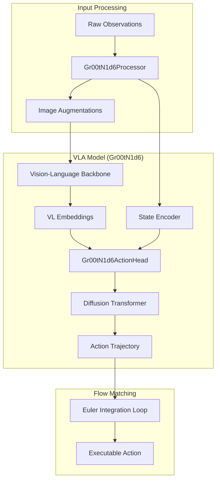

# gr00t_n1d6_model

The **gr00t_n1d6_model** module implements the core Vision-Language-Action (VLA) architecture for the Isaac-GR00T project, integrating high-resolution visual backbones with flow-matching diffusion policies. It provides a modular framework for training and deploying robot control models that can generalize across different embodiments and tasks.

---

## Overview

The module serves as the primary implementation of the N1D6 model variant. It is designed to process multimodal inputs—visual streams, natural language instructions, and robot proprioceptive states—to generate precise action trajectories. Key responsibilities include:

- **Multimodal Fusion:** Combining vision-language features from pretrained backbones with robot state information.
- **Action Generation:** Employing a flow-matching diffusion process in the [`Gr00tN1d6ActionHead`](../gr00t/model/gr00t_n1d6/gr00t_n1d6.py#L19) to predict robust and continuous action sequences.
- **Data Normalization:** Ensuring consistent input formatting and scaling across diverse robot embodiments using the [`Gr00tN1d6Processor`](../gr00t/model/gr00t_n1d6/processing_gr00t_n1d6.py#L108).
- **Scalable Setup:** Providing a unified [`Gr00tN1d6Pipeline`](../gr00t/model/gr00t_n1d6/setup.py#L32) for model initialization, checkpoint loading, and dataset orchestration.

---

## Architecture

The N1D6 architecture follows a decoupled design where a heavy visual-language backbone extracts semantic context, which then conditions a lighter, high-frequency diffusion transformer for action prediction.

The architecture supports multiple backbones (e.g., [`EagleBackbone`](../gr00t/model/modules/eagle_backbone.py#L8)) and can be configured to use either a standard [`DiT`](../gr00t/model/modules/dit.py#L172) or an [`AlternateVLDiT`](../gr00t/model/modules/dit.py#L289) for the diffusion process.

---

## Core Components

> **Start here:** [`Gr00tN1d6`](../gr00t/model/gr00t_n1d6/gr00t_n1d6.py#L411) — read its `forward()` method to understand how the backbone and action head are coordinated during a training step.

### [`Gr00tN1d6`](../gr00t/model/gr00t_n1d6/gr00t_n1d6.py#L411)
The central model class that inherits from HuggingFace's `PreTrainedModel`. It orchestrates the flow between the vision-language backbone and the action head.
- **Primary Method:** `forward(inputs)` — Executes the full VLA pipeline, computing the action prediction loss.
- **Inference Method:** `get_action(inputs)` — Triggers the internal diffusion sampling process to return a predicted action trajectory.

### [`Gr00tN1d6ActionHead`](../gr00t/model/gr00t_n1d6/gr00t_n1d6.py#L19)
The generative component responsible for predicting actions. It implements a flow-matching objective where the model predicts the velocity field required to transform noise into a valid action trajectory.
- **Key Methods:**
  - `sample_time(batch_size, ...)` — Samples timesteps from a Beta distribution to weight the diffusion loss.
  - `get_action_with_features(...)` — Performs the iterative Euler integration to "denoise" an action trajectory.
- **Conditioning:** Uses [`CategorySpecificMLP`](../gr00t/model/modules/embodiment_conditioned_mlp.py#L128) to project robot states and actions into a latent space conditioned on specific embodiment IDs.

### [`Gr00tN1d6Processor`](../gr00t/model/gr00t_n1d6/processing_gr00t_n1d6.py#L108)
A comprehensive preprocessing utility that handles the complexities of multimodal robot data.
- **State/Action Handling:** Utilizes [`StateActionProcessor`](../gr00t/data/state_action/state_action_processor.py#L33) for normalization and relative-to-absolute action conversions.
- **Image Pipeline:** Integrates custom transforms like [`LetterBoxTransform`](../gr00t/model/gr00t_n1d6/image_augmentations.py#L262) and [`FractionalRandomCrop`](../gr00t/model/gr00t_n1d6/image_augmentations.py#L62) to prepare visual inputs.
- **Language:** Normalizes text instructions and formats conversations for the VLM backbone using chat templates.

### [`Gr00tN1d6Pipeline`](../gr00t/model/gr00t_n1d6/setup.py#L32)
The setup class used by the [training_engine](training_engine.md) to instantiate the experiment environment.
- **Primary Method:** `setup()` — Initializes the model, processor, and datasets.
- **Initialization Logic:** Handles checkpoint loading via `AutoModel.from_pretrained` and ensures that specialized tokens (like `mask_token`) are correctly initialized if missing from base weights.

---

## Usage & Extension

### Entry Points
- **Deployment:** For real-time inference, use the `get_action` method. See [policy_inference](policy_inference.md) for wrapping this in a control loop.
- **Preprocessing:** The [`Gr00tN1d6DataCollator`](../gr00t/model/gr00t_n1d6/processing_gr00t_n1d6.py#L56) is used to batch processed features for GPU execution.

### Configuration
The model is configured via [`Gr00tN1d6Config`](../gr00t/configs/model/gr00t_n1d6.py#L13).

| Parameter | Type | Default | Description |
| :--- | :--- | :--- | :--- |
| `model_name` | `str` | N/A | HF identifier for the visual backbone (e.g., `nvidia/Eagle-Block2A-2B-v2`). |
| `use_alternate_vl_dit` | `bool` | `False` | Enables [`AlternateVLDiT`](../gr00t/model/modules/dit.py#L289) for deeper vision-language fusion. |
| `action_horizon` | `int` | `40` | The length of the action trajectory sequence to predict. |
| `state_dropout_prob` | `float` | `0.0` | Probability of masking robot state during training to improve visual reliance. |
| `tune_diffusion_model`| `bool` | `True` | Whether to train the diffusion transformer weights. |

### Extension Points
1. **New Embodiments:** Register new robot types by adding their tags to `EMBODIMENT_TAG_TO_PROJECTOR_INDEX` in [`processing_gr00t_n1d6.py`](../gr00t/model/gr00t_n1d6/processing_gr00t_n1d6.py#L42).
2. **Custom Augmentations:** Extend [`image_augmentations.py`](../gr00t/model/gr00t_n1d6/image_augmentations.py) with new `albumentations` or `torchvision` transforms and update the `build_image_transformations` factory.
3. **Alternative Backbones:** Add support for new VLM architectures by updating the `get_backbone_cls` helper in [`gr00t_n1d6.py`](../gr00t/model/gr00t_n1d6/gr00t_n1d6.py).

### Error Handling
- **Missing Checkpoint Keys:** [`Gr00tN1d6Pipeline`](../gr00t/model/gr00t_n1d6/setup.py#L32) catches missing `mask_token` keys during loading and initializes them randomly.
- **Unsupported Backbones:** `get_backbone_cls` raises a `ValueError` if an unknown `model_name` is provided.
- **Data Validation:** [`Gr00tN1d6Processor`](../gr00t/model/gr00t_n1d6/processing_gr00t_n1d6.py#L108) asserts that incoming message batches are valid and raises implementation errors for unsupported multimodal keys.

---

## Integration

- **[configuration](configuration.md):** Provides the foundational [`Gr00tN1d6Config`](../gr00t/configs/model/gr00t_n1d6.py#L13).
- **[data_pipeline](data_pipeline.md):** Supplies normalized episodes via [`DatasetFactory`](../gr00t/data/dataset/factory.py#L14).
- **[diffusion_transformer](diffusion_transformer.md):** Implements the [`DiT`](../gr00t/model/modules/dit.py#L172) modules used in the action head.
- **[eagle_backbone](eagle_backbone.md):** Provides the [`EagleBackbone`](../gr00t/model/modules/eagle_backbone.py#L8) implementation for visual features.
- **[training_engine](training_engine.md):** Uses the pipeline to execute training runs.