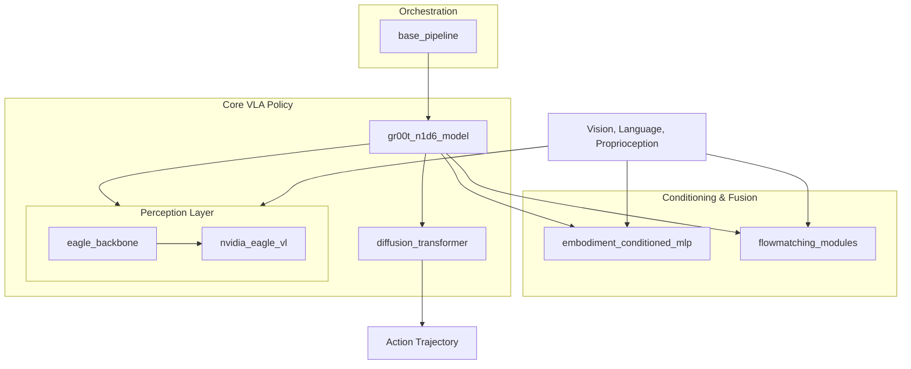

# Model Architecture

The `model_architecture` module implements the core Vision-Language-Action (VLA) neural network architectures for the Isaac-GR00T project. It provides a modular and extensible framework for perception, multimodal fusion, and generative action prediction, designed to support diverse robot embodiments and high-performance visual backbones.

---

## Purpose

This module serves as the primary implementation layer for the GR00T policy. Its main responsibilities include:
- **Multimodal Perception**: Processing high-resolution visual streams and natural language instructions using state-of-the-art backbones.
- **Generative Action Prediction**: Implementing flow-matching and diffusion-based policies to generate robust robot action trajectories.
- **Multi-Embodiment Support**: Utilizing conditioned layers to allow a single model to control various robot types (humanoids, manipulators, etc.).
- **Lifecycle Management**: Providing standardized pipelines for model initialization, parameter management, and dataset integration.

---

## Architecture

The architecture follows a decoupled design where perceptual features are extracted from multimodal inputs and then used to condition a high-frequency generative head for action prediction.

---

## Core Components Documentation

The `model_architecture` module is composed of several specialized sub-modules:

- **[Base Pipeline](base_pipeline.md)**: Defines the standardized interface and orchestration layer for initializing model architectures and data environments.
- **[GR00T N1D6 Model](gr00t_n1d6_model.md)**: The primary VLA implementation that integrates the visual backbone with the generative action head.
- **[Diffusion Transformer](diffusion_transformer.md)**: Implements the transformer blocks used for action denoising and velocity prediction in diffusion processes.
- **[Eagle Backbone](eagle_backbone.md)**: Provides a high-level wrapper for the NVIDIA Eagle Vision-Language Model as the perceptual foundation.
- **[Embodiment Conditioned MLP](embodiment_conditioned_mlp.md)**: Contains specialized layers that condition weights on robot-specific identifiers for multi-embodiment training.
- **[Flow-Matching Modules](flowmatching_modules.md)**: Supplies utilities for encoding continuous action trajectories and temporal conditioning.
- **[NVIDIA Eagle VL](nvidia_eagle_vl.md)**: Detailed modeling and configuration for the low-level Eagle-3 Vision-Language architecture.