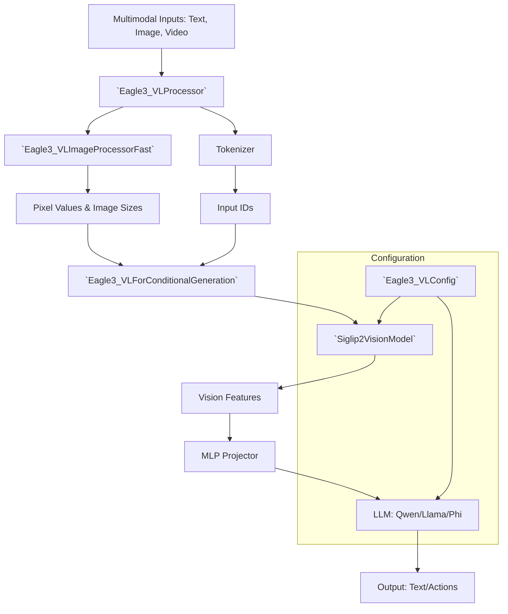

# nvidia_eagle_vl

The `nvidia_eagle_vl` module implements the NVIDIA Eagle-3 Vision-Language (VL) architecture, providing a highly optimized pipeline for multimodal processing in VLA models. It integrates advanced vision backbones with large language models through specialized projectors and efficient data handling for both static images and temporal video sequences.

## Overview

The `nvidia_eagle_vl` module serves as the primary interface for NVIDIA's Eagle-Block2A-2B-v2 multimodal architecture. Its key responsibilities include:
- **Multimodal Configuration**: Unified management of vision and text model configurations via [`Eagle3_VLConfig`](../gr00t/model/modules/nvidia/Eagle-Block2A-2B-v2/configuration_eagle3_vl.py#L14).
- **Efficient Visual Processing**: High-performance image and video frame processing through [`Eagle3_VLImageProcessorFast`](../gr00t/model/modules/nvidia/Eagle-Block2A-2B-v2/image_processing_eagle3_vl_fast.py#L95), supporting dynamic resolution and padding.
- **Multimodal Reasoning**: Implementing the [`Eagle3_VLForConditionalGeneration`](../gr00t/model/modules/nvidia/Eagle-Block2A-2B-v2/modeling_eagle3_vl.py#L78) model which combines a vision backbone (e.g., SigLIP-2) with a causal language model using an MLP projector.
- **Optimized Feature Extraction**: Utilizing [`Siglip2VisionModel`](../gr00t/model/modules/nvidia/Eagle-Block2A-2B-v2/modeling_siglip2.py#L1364) with 2D Rotary Position Embeddings ([`Rope2DPosEmb`](../gr00t/model/modules/nvidia/Eagle-Block2A-2B-v2/modeling_siglip2.py#L630)) for state-of-the-art visual feature representation.

## Architecture

The following diagram illustrates the relationship between the core components of the `nvidia_eagle_vl` module and how they interact to process multimodal inputs.



The architecture follows a modular design where [`Eagle3_VLProcessor`](../gr00t/model/modules/nvidia/Eagle-Block2A-2B-v2/processing_eagle3_vl.py#L462) coordinates the preprocessing of text and visual data. The resulting features are passed to [`Eagle3_VLForConditionalGeneration`](../gr00t/model/modules/nvidia/Eagle-Block2A-2B-v2/modeling_eagle3_vl.py#L78), which leverages a vision backbone to extract high-dimensional embeddings. These embeddings are projected into the LLM's embedding space via an MLP, allowing the language model to reason over the combined visual and textual context.

## Core Components

> **Start here:** [`Eagle3_VLForConditionalGeneration`](../gr00t/model/modules/nvidia/Eagle-Block2A-2B-v2/modeling_eagle3_vl.py#L78) — read its `forward()` method first to understand the multimodal fusion logic.

### Eagle3_VLForConditionalGeneration

The [`Eagle3_VLForConditionalGeneration`](../gr00t/model/modules/nvidia/Eagle-Block2A-2B-v2/modeling_eagle3_vl.py#L78) class is the primary model implementation for conditional generation tasks. It inherits from [`Eagle3_VLPreTrainedModel`](../gr00t/model/modules/nvidia/Eagle-Block2A-2B-v2/modeling_eagle3_vl.py#L53) and integrates the vision backbone and language model.

- **Primary Method**: `forward()` — processes pixel values and input IDs to produce logits and loss.
- **Key Methods**:
  - `extract_feature()`: Extracts and projects visual features using the vision model and MLP.
  - `pixel_shuffle_back()`: Reconstructs spatial features from flattened tokens for the projector.
  - `generate()`: High-level API for autoregressive generation.

### Eagle3_VLProcessor

The [`Eagle3_VLProcessor`](../gr00t/model/modules/nvidia/Eagle-Block2A-2B-v2/processing_eagle3_vl.py#L462) provides a unified interface for preparing data. It manages the replacement of media placeholders (e.g., `<image-1>`, `<video-1>`) with the appropriate tokens.

- **Primary Method**: `__call__()` — prepares both text and visual inputs for the model.
- **Key Method**: `replace_media_placeholder()` — handles the insertion of vision tokens into the text prompt based on visual input metadata.

### Eagle3_VLConfig

[`Eagle3_VLConfig`](../gr00t/model/modules/nvidia/Eagle-Block2A-2B-v2/configuration_eagle3_vl.py#L14) manages the complex configuration of the multimodal model, including LoRA settings and sub-model configurations.

| Parameter | Type | Default | Description |
|-----------|------|---------|-------------|
| `vision_config` | `dict` | `None` | Configuration for the vision backbone. |
| `text_config` | `dict` | `None` | Configuration for the language model. |
| `use_backbone_lora` | `int` | `0` | Rank for vision backbone LoRA. |
| `use_llm_lora` | `int` | `0` | Rank for LLM LoRA. |
| `select_layer` | `int` | `-4` | Vision feature layer to extract. |
| `downsample_ratio`| `float`| `0.5` | Ratio for spatial feature downsampling. |

### Siglip2VisionModel

The [`Siglip2VisionModel`](../gr00t/model/modules/nvidia/Eagle-Block2A-2B-v2/modeling_siglip2.py#L1364) is an advanced vision transformer optimized for high-resolution feature extraction.

- **Primary Method**: `forward()` — extracts last hidden states from images.
- **Key Sub-components**:
  - [`Siglip2VisionTransformer`](../gr00t/model/modules/nvidia/Eagle-Block2A-2B-v2/modeling_siglip2.py#L1059): Core transformer architecture.
  - [`Rope2DPosEmb`](../gr00t/model/modules/nvidia/Eagle-Block2A-2B-v2/modeling_siglip2.py#L630): Implements 2D Rotary Position Embeddings for better spatial awareness.
  - [`Siglip2Attention`](../gr00t/model/modules/nvidia/Eagle-Block2A-2B-v2/modeling_siglip2.py#L764): Multi-head attention with support for windowed attention and Flash Attention.

### Eagle3_VLImageProcessorFast

The [`Eagle3_VLImageProcessorFast`](../gr00t/model/modules/nvidia/Eagle-Block2A-2B-v2/image_processing_eagle3_vl_fast.py#L95) is designed for speed, utilizing Torch-based operations for image transformations.

- **Primary Method**: `preprocess()` — resizes, normalizes, and stacks images or video frames.
- **Parameters**: Defined in [`Eagle3_VLFastImageProcessorKwargs`](../gr00t/model/modules/nvidia/Eagle-Block2A-2B-v2/image_processing_eagle3_vl_fast.py#L78), including `do_pad` and `size` settings.

## Usage & Extension

### Initialization
Developers can initialize the full VLA model and its processor using standard Transformers patterns:

```python
from gr00t.model.modules.nvidia.Eagle_Block2A_2B_v2.modeling_eagle3_vl import Eagle3_VLForConditionalGeneration
from gr00t.model.modules.nvidia.Eagle_Block2A_2B_v2.processing_eagle3_vl import Eagle3_VLProcessor

processor = Eagle3_VLProcessor.from_pretrained("path/to/checkpoint")
model = Eagle3_VLForConditionalGeneration.from_pretrained("path/to/checkpoint")
```

### Adding New Backbones
To extend the module with a new vision backbone:
1.  Update [`Eagle3_VLConfig`](../gr00t/model/modules/nvidia/Eagle-Block2A-2B-v2/configuration_eagle3_vl.py#L14) to support the new `model_type`.
2.  Modify the `__init__` of [`Eagle3_VLForConditionalGeneration`](../gr00t/model/modules/nvidia/Eagle-Block2A-2B-v2/modeling_eagle3_vl.py#L78) to instantiate the new backbone.
3.  Ensure the new backbone's output format is compatible with the MLP projector expectations.

## Integration

The `nvidia_eagle_vl` module integrates deeply with several other system components:
- [configuration.md](configuration.md): Provides the base configuration classes extended by `Eagle3_VLConfig`.
- [data_pipeline.md](data_pipeline.md): Utilizes `Eagle3_VLProcessor` for preparing training and inference batches.
- [model_architecture.md](model_architecture.md): Contextualizes how Eagle-3 fits into the overall model hierarchy.
- [eagle_backbone.md](eagle_backbone.md): Details on the underlying Eagle backbone structures.

---