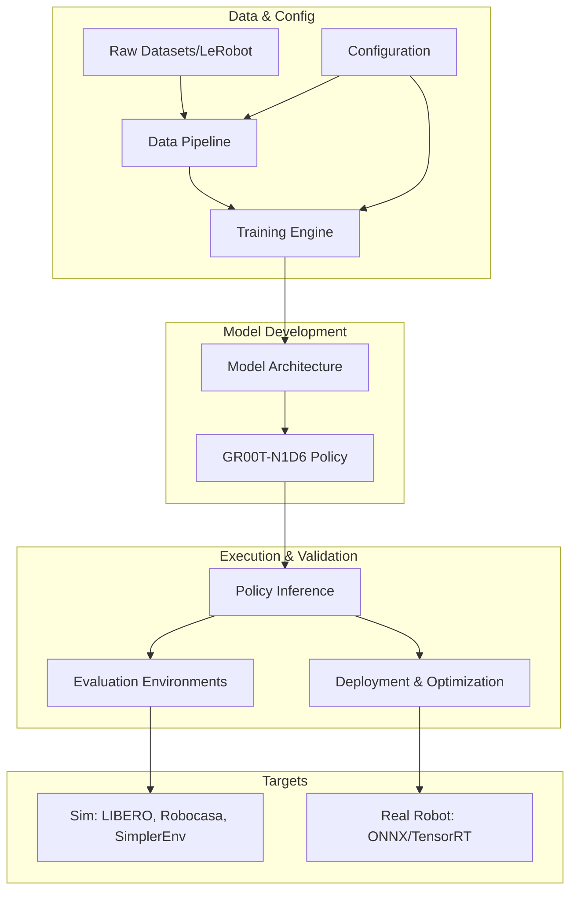

# Isaac-GR00T Repository Overview

Isaac-GR00T is a comprehensive framework for developing, training, and deploying Vision-Language-Action (VLA) models for multi-embodiment robotic control. The repository implements a modular architecture centered around the GR00T-N1D6 model, which utilizes high-resolution visual perception and natural language instructions to generate robust action trajectories via a Diffusion Transformer (DiT) head.

The system is designed to support cross-embodiment learning, allowing a single model to control diverse robotic platforms—ranging from humanoids like the GR1 and G1 to manipulators like the SO100—across both simulated and real-world environments.

---

## End-to-End Architecture

The following diagram illustrates the high-level flow from data ingestion and model training to policy inference and deployment.

---

## Core Modules

The repository is organized into several functional modules, each handling a specific part of the VLA lifecycle:

*   [Configuration](configuration.md): A centralized, type-safe system for managing model hyperparameters, dataset specifications, and training settings.
*   [Data Pipeline](data_pipeline.md): Infrastructure for loading, processing, and batching multi-modal robotic data (images, states, actions, text).
*   [Model Architecture](model_architecture.md): Implementation of the VLA neural networks, including the visual backbone and the Diffusion Transformer action head.
*   [Training Engine](training_engine.md): A specialized training framework optimized for robotic data throughput and action-specific metrics.
*   [Policy Inference](policy_inference.md): High-level interfaces for running models in local, networked, or replay modes.
*   [Evaluation Environments](evaluation_environments.md): Gymnasium wrappers for aligning simulation environments with model temporal requirements and recording rollouts.
*   [Deployment](deployment.md): Tools for exporting models to ONNX and accelerating inference via TensorRT for real-time control.

---

## Supplementary Data

The following machine-readable data files are available in this directory for programmatic use:

*   `module_tree.json`: Contains the hierarchical module structure and detailed component assignments (classes, functions) for the entire project.
*   `dependency_graph.json`: Provides the full dependency graph with all code components, including file paths, line numbers, source code snippets, and call relationships, facilitating automated code navigation and analysis.