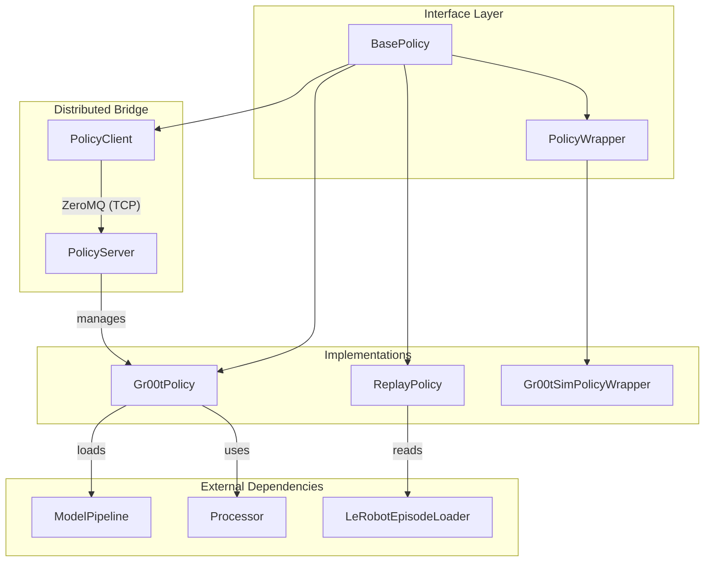

# policy_inference

Provides high-level interfaces and infrastructure for running Gr00t models in inference mode, including local execution, recorded data replay, and networked client-server distribution.

---

## Overview

The **policy_inference** module abstracts the complexity of robotic control policies behind a unified interface. Its primary responsibilities include:

- Defining a standard execution lifecycle through the [`BasePolicy`](../gr00t/policy/policy.py#L5) interface.
- Managing model loading, hardware acceleration (GPU), and data precision for real-time inference via [`Gr00tPolicy`](../gr00t/policy/gr00t_policy.py#L46).
- Facilitating distributed inference where high-performance compute is separated from robot hardware using [`PolicyServer`](../gr00t/policy/server_client.py#L51) and [`PolicyClient`](../gr00t/policy/server_client.py#L150).
- Providing compatibility layers for simulation environments through [`Gr00tSimPolicyWrapper`](../gr00t/policy/gr00t_policy.py#L420).
- Supporting deterministic evaluation and debugging via [`ReplayPolicy`](../gr00t/policy/replay_policy.py#L18).

---

## Architecture

The module is built on an inheritance-based architecture where all control logic adheres to a common "Get Action" interface. This allows developers to swap a live model for a replay script or a remote server without changing the robot's control loop.



---

## Core Components

> **Start here:** [`BasePolicy`](../gr00t/policy/policy.py#L5) — the abstract base class defining the standard interface for all robotic control policies.

### [`BasePolicy`](../gr00t/policy/policy.py#L5)
The foundational class for all control strategies. It enforces a strict validation pipeline to ensure that observations from sensors and actions from models are compatible.

- **Primary Entry Point:** [`get_action()`](../gr00t/policy/policy.py#L65) — the public method used by environments. It validates the observation, calls the internal computation logic, and validates the resulting action before returning.

| Method | Description |
| :--- | :--- |
| [`check_observation`](../gr00t/policy/policy.py#L22) | Validates input observation dictionary structure, shapes, and dtypes. |
| [`check_action`](../gr00t/policy/policy.py#L34) | Validates predicted action dictionary against the robot's action space. |
| [`_get_action`](../gr00t/policy/policy.py#L46) | Abstract method where subclasses implement specific inference or replay logic. |
| [`reset`](../gr00t/policy/policy.py#L93) | Resets internal state, hidden layers, or sequence counters. |

### [`Gr00tPolicy`](../gr00t/policy/gr00t_policy.py#L46)
The implementation for running pretrained Vision-Language-Action (VLA) models. It handles the conversion of raw sensor data into model-ready tensors and decodes model outputs into physical units.

- **Inference Pipeline:** Internally utilizes [`_rec_to_dtype`](../gr00t/policy/gr00t_policy.py#L20) to recursively convert observations to `torch.bfloat16` for efficient execution.
- **Data Transformation:** Converts raw observations into [`VLAStepData`](../gr00t/data/types.py#L36) using [`_to_vla_step_data()`](../gr00t/policy/gr00t_policy.py#L125) before passing them to the model processor.
- **Unbatching:** Provides [`_unbatch_observation()`](../gr00t/policy/gr00t_policy.py#L104) to split parallel environment observations into individual samples for the processor.

### [`Gr00tSimPolicyWrapper`](../gr00t/policy/gr00t_policy.py#L420)
A specialized **PolicyWrapper** used to bridge simulation environments with the core policy. 

- **Format Mapping:** Many simulation environments (like Isaac Gym or Robocasa) use flat keys (e.g., `video.front_cam`). This wrapper maps those to the nested format expected by [`Gr00tPolicy`](../gr00t/policy/gr00t_policy.py#L46).
- **Legacy Patching:** Handles special cases like mapping the `task` instruction to the `annotation.human.coarse_action` key used in older dataset formats.

### [`ReplayPolicy`](../gr00t/policy/replay_policy.py#L18)
A utility policy that enables replaying historical actions from a dataset (using [`LeRobotEpisodeLoader`](../gr00t/data/dataset/lerobot_episode_loader.py#L63)) while maintaining the same observation validation as a live model. This is critical for visual debugging and comparing model predictions against ground truth.

### Distributed Inference (Server/Client)
The system provides a robust solution for offloading inference to remote GPU servers using ZeroMQ.

1. **[`PolicyServer`](../gr00t/policy/server_client.py#L51):** Hosts a policy instance and exposes methods via a `REP` socket. It uses [`EndpointHandler`](../gr00t/policy/server_client.py#L46) to route network requests.
2. **[`PolicyClient`](../gr00t/policy/server_client.py#L150):** A lightweight implementation of [`BasePolicy`](../gr00t/policy/policy.py#L5) that forwards [`get_action`](../gr00t/policy/server_client.py#L231) and [`reset`](../gr00t/policy/server_client.py#L237) calls over the network.
3. **[`MsgSerializer`](../gr00t/policy/server_client.py#L15):** Handles the serialization of complex types, specifically managing [`numpy.ndarray`](../gr00t/policy/server_client.py#L40) and [`ModalityConfig`](../gr00t/policy/server_client.py#L38) objects for binary transit.

---

## Usage & Extension

### Local Model Instantiation
To run a local model, initialize the policy with an [`EmbodimentTag`](../gr00t/data/embodiment_tags.py#L14) and the path to a pretrained checkpoint.

```python
from gr00t.policy.gr00t_policy import Gr00tPolicy
from gr00t.data.embodiment_tags import EmbodimentTag

policy = Gr00tPolicy(
    embodiment_tag=EmbodimentTag.GR1,
    model_path="./checkpoints/gr1_baseline",
    device="cuda:0"
)

# In the control loop
action, info = policy.get_action(observation)
```

### Implementing a Custom Policy
To extend the system with a new control strategy:
1. Inherit from [`BasePolicy`](../gr00t/policy/policy.py#L5).
2. Implement [`check_observation()`](../gr00t/policy/policy.py#L22) to define your required inputs (e.g., specific camera views).
3. Implement [`_get_action()`](../gr00t/policy/policy.py#L46) with your logic.
4. Ensure the returned dictionary matches the action space verified in [`check_action()`](../gr00t/policy/policy.py#L34).

---

## Integration

- **Model Architecture:** Loads model backbones via `AutoModel`, integrating with the components described in [model_architecture.md](model_architecture.md).
- **Data Pipeline:** Relies on [`Gr00tN1d6Processor`](../gr00t/model/gr00t_n1d6/processing_gr00t_n1d6.py#L108) for modality unnormalization and input collation.
- **Configurations:** Uses [`ModalityConfig`](../gr00t/data/types.py#L69) to determine temporal horizons for history and action chunking.
- **Evaluation:** Directly consumed by the rollout scripts and evaluation environments detailed in [evaluation_environments.md](evaluation_environments.md).