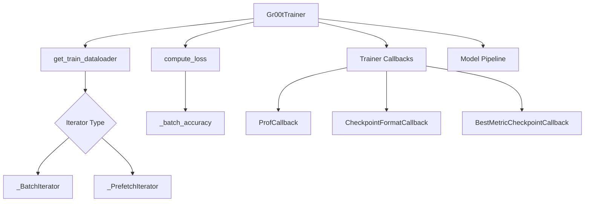

# Training Engine

The **Training Engine** module provides a specialized training framework based on HuggingFace's `Trainer`, optimized for the GR00T model's multi-modal data requirements and large-scale training. It handles custom data loading, performance profiling, and specialized checkpointing logic to ensure robust and efficient model optimization.

## Overview

The training engine is designed to bridge the gap between complex robotic datasets and standard deep learning training loops. It focuses on three primary responsibilities:
- Efficient data ingestion through custom iterators and prefetching mechanisms that minimize GPU starvation.
- Specialized loss computation that tracks token-level accuracy for action predictions alongside standard cross-entropy loss.
- Comprehensive experiment management through standalone checkpointing and metric-based model selection.

---

## Architecture

The following diagram illustrates how the **Gr00tTrainer** coordinates the interaction between data loading, model execution, and callback-driven utilities.

The [`Gr00tTrainer`](../gr00t/experiment/trainer.py#L178) orchestrates the training lifecycle by overriding core HuggingFace `Trainer` methods to inject custom logic for data handling and metric reporting. It utilizes specialized iterators like [`_PrefetchIterator`](../gr00t/experiment/trainer.py#L63) to ensure the model is never starved of data, while callbacks manage the persistence of experiment state and performance monitoring.

---

## Core Components

> **Start here:** [`Gr00tTrainer`](../gr00t/experiment/trainer.py#L178) — read its [`train()`](../gr00t/experiment/trainer.py#L228) method first to understand how it initiates the training loop with checkpoint resuming logic.

### Gr00tTrainer

The [`Gr00tTrainer`](../gr00t/experiment/trainer.py#L178) is the central orchestrator of the training process, extending the standard HuggingFace `Trainer` to support robotic-specific requirements. It manages the training loop, integrates custom data loaders, and overrides loss calculation to include action-specific metrics.

- **Primary Method:** [`train()`](../gr00t/experiment/trainer.py#L228) initiates the training process, handling checkpoint resumption and state restoration.
- **Data Loading:** [`get_train_dataloader()`](../gr00t/experiment/trainer.py#L198) provides a custom data loader that supports sharded datasets and persistent workers, ensuring efficient data throughput.
- **Loss Calculation:** [`compute_loss()`](../gr00t/experiment/trainer.py#L254) calculates the training loss and logs token-level accuracy via [`_batch_accuracy()`](../gr00t/experiment/trainer.py#L98) every logging step.
- **Accuracy Computation:** The [`_batch_accuracy()`](../gr00t/experiment/trainer.py#L98) function computes token-level accuracy for action tokens, ignoring mask positions.

### Data Iterators

The engine provides specialized iterators to handle the flow of pre-collated batches from the dataset buffers.

- **_BatchIterator:** A lightweight [`_BatchIterator`](../gr00t/experiment/trainer.py#L37) that yields pre-collated batches from a buffer using a single lock acquisition per batch.
- **_PrefetchIterator:** The [`_PrefetchIterator`](../gr00t/experiment/trainer.py#L63) uses a background thread to pre-collate and queue batches, minimizing data-loading bottlenecks during GPU execution.
- **Worker Management:** The [`_fill()`](../gr00t/experiment/trainer.py#L77) method in the prefetcher runs as a daemon thread to populate the internal queue.

### Experiment Utilities & Callbacks

Specialized callbacks manage the lifecycle of the experiment, focusing on performance profiling and checkpoint integrity.

- **ProfCallback:** The [`ProfCallback`](../gr00t/experiment/trainer.py#L29) triggers profiling steps to measure data loading and forward-pass latency during [`on_step_end()`](../gr00t/experiment/trainer.py#L33).
- **CheckpointFormatCallback:** The [`CheckpointFormatCallback`](../gr00t/experiment/utils.py#L9) ensures that every saved checkpoint is standalone by copying experiment configurations, metadata, and processor files into the checkpoint directory via its [`on_save()`](../gr00t/experiment/utils.py#L29) method.
- **BestMetricCheckpointCallback:** The [`BestMetricCheckpointCallback`](../gr00t/experiment/utils.py#L56) monitors evaluation metrics via [`on_evaluate()`](../gr00t/experiment/utils.py#L70) and preserves the best performing model based on user-defined criteria.

---

## Usage & Extension

### Configuration

The training engine is configured primarily through `TrainingArguments` and specific parameters passed to the [`Gr00tTrainer`](../gr00t/experiment/trainer.py#L178) constructor.

| Parameter | Type | Default | Description |
| :--- | :--- | :--- | :--- |
| `action_offset` | `int` | `None` | Index offset used in [`compute_loss()`](../gr00t/experiment/trainer.py#L254) to isolate action tokens for accuracy calculation. |
| `multiprocessing_context` | `str` | `"fork"` | The context used for multi-process data loading in [`get_train_dataloader()`](../gr00t/experiment/trainer.py#L198). |
| `logging_steps` | `int` | `500` | Frequency (in steps) for logging metrics and accuracy within [`compute_loss()`](../gr00t/experiment/trainer.py#L254). |

### Extending the Trainer

To add custom logic to the training process, developers can follow these patterns:
1. **New Metrics:** Implement a metric calculation function similar to [`compute_eval_accuracy()`](../gr00t/experiment/trainer.py#L139) and pass it to the trainer.
2. **Custom Callbacks:** Inherit from `TrainerCallback` and implement hooks like `on_step_end` or `on_evaluate` to inject logic at specific lifecycle points, following the pattern in [`CheckpointFormatCallback`](../gr00t/experiment/utils.py#L9).
3. **Loss Modification:** Override [`compute_loss()`](../gr00t/experiment/trainer.py#L254) in a subclass of [`Gr00tTrainer`](../gr00t/experiment/trainer.py#L178) to implement specialized loss functions or auxiliary task weighting.

### Error Handling

The training engine relies on the underlying HuggingFace and PyTorch error handling mechanisms:
- **Checkpoint Failures:** If a checkpoint is missing or corrupt during resume, [`train()`](../gr00t/experiment/trainer.py#L228) logs a warning and may fail or start from scratch depending on the configuration.
- **Data Bottlenecks:** The [`_PrefetchIterator`](../gr00t/experiment/trainer.py#L63) uses a thread-safe queue; if data loading is slower than the model, the training step will block on its internal `get()` call.

---

## Integration

The **Training Engine** interacts closely with several other modules in the system:
- [**Configuration**](configuration.md) — Uses [`TrainingConfig`](../gr00t/configs/training/training_config.py#L6) and [`FinetuneConfig`](../gr00t/configs/finetune_config.py#L8) to define hyperparameters.
- [**Data Pipeline**](data_pipeline.md) — Consumes datasets produced by [`DatasetFactory`](../gr00t/data/dataset/factory.py#L14) and collated by [`BasicDataCollator`](../gr00t/data/collator/collators.py#L6).
- [**Model Architecture**](model_architecture.md) — Optimizes instances of [`ModelPipeline`](../gr00t/model/base/model_pipeline.py#L14) or specific models like [`Gr00tN1d6`](../gr00t/model/gr00t_n1d6/gr00t_n1d6.py#L411).